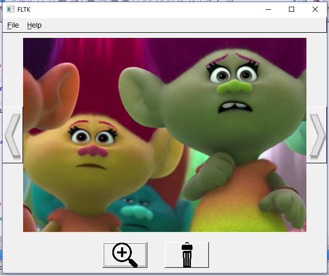

# OWP_Image_Viewer
Tutorial under our series One Week Projects (OWP) which will focus on projects that can be made in approximately one week while still being useful. We will try to make a decent image viewer application in this tutorial. Users are expected to go through each commit and learn step by step from there. Hence a very basic understanding of git is inherent pre-requisite.  
  
This is a cross-platform gui tutorial. This is made with FLTK API for C++ in Code::Blocks IDE. The target audience is expected to know something about OOPs. And also should have atleast some idea of what are pointers and how they are handled.  
FLTK library is very lightweight and portable. By cross-platform we mean that the same code can be compiled on any platform/OS and run without requiring any significant change. There are many cross-platform GUI APIs for C++ out there. But most of them use macros to an extent that things seem to be magical at first. But FLTK. unlike others, is extremely simple in usage and doesn't require any magical macros to be invoked while still being powerful enough to create the most complex GUIs with ease. Another reason for choosing FLTK for this tutorial is that it has inherent support for OpenGL which can come in handy if you are writing an application which needs to deal with 3-D graphics while also providing a good GUI. At the end of the tutorial, hopefully the reader will be able to appeciate the ease of use of FLTK library.  
  
## Navigating this tutorial
We understand that many readers might not have familiarity with the `git` framework and hence we have added a guide to explain all the required commands to properly navigate this tutorial. Please have a look at it if you are not familiar with git. The guide is a pdf file named [Navigating_OWP_Image_Viewer.pdf](Navigating_OWP_Image_Viewer.pdf) present with this tutorial.  
  
  
## Running the code
- Download latest windows binary of Code::Blocks IDE from http://www.codeblocks.org/downloads and select the file that ends with "mingw-setup.exe" as it will contain the MinGW toolchains for windows which will be used for compiling and linking.  
- EITHER download source for FLTK 1.3.4 from its official site (http://www.fltk.org) and build FLTK for you platform using the [Building_FLTK.md](Building_FLTK.md) guide provided here OR download the fltk_1.3.4.rar provided in this repo and extract its contents. If you are on Linux/Mac you will have to build the library yourself, the rar provided here is for windows only.  
After this, EITHER:
- Create a new FLTK project in codeblocks and provide the directory of FLTK when asked.
- Add the *.h and *.cpp files of this repo into your project (You will need to copy contents of main.cpp) and build the project
OR:
- Clone this repo. And open the ".cbp" file which should open in the IDE.  
- In CodeBlocks goto Settings->Compiler->Search Directories. Add the "fltk_1.3.4/include" directory in the Compiler Tab.
- In the "Linker Settings" tab add all the *.a files in "fltk_1.3.4/lib" directory in the "Link Libraries" pane.
- Close the dialog box and Build and Run the project in Release mode.  
  
You can look at the following screenshot to get an idea of how the finished product will look like:  
  
  
Although the code is being provided, a learner is expected to run the code and go through the stages of how it was made. And then try him/her self to make some other software or an extension of the provided software. If you make something derived/inspired from this code, you can let us know and we can provide a link to your repository in a separate section of this readme.  
Very basic decription of each commit will be given in the file [Steps.md](Steps.md). Learners are expected to use google to learn the in-depth intricasies. These tutorials are meant to promote learning-via-coding.  
